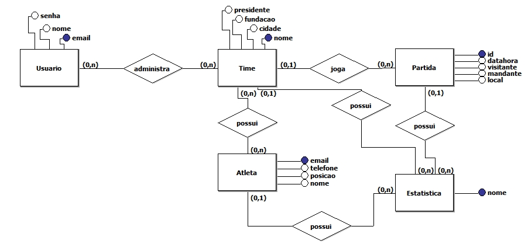
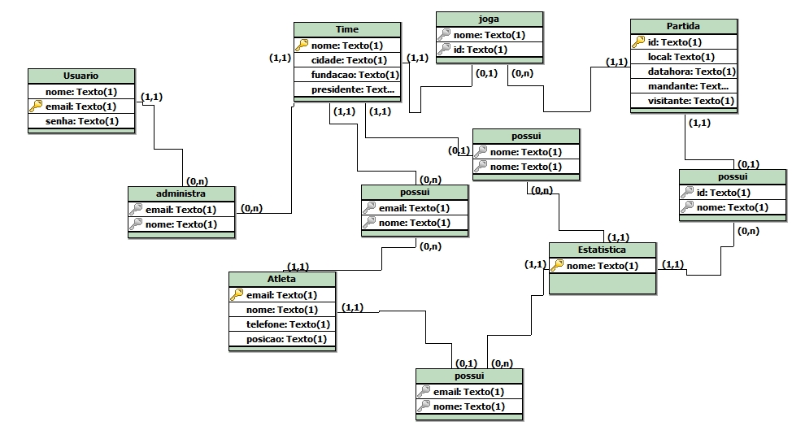
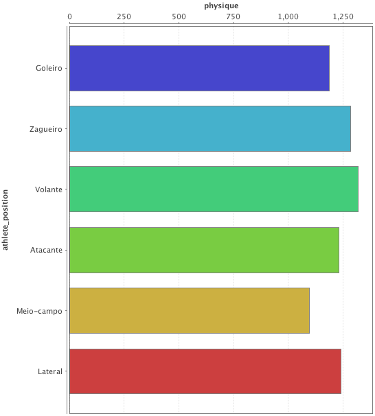
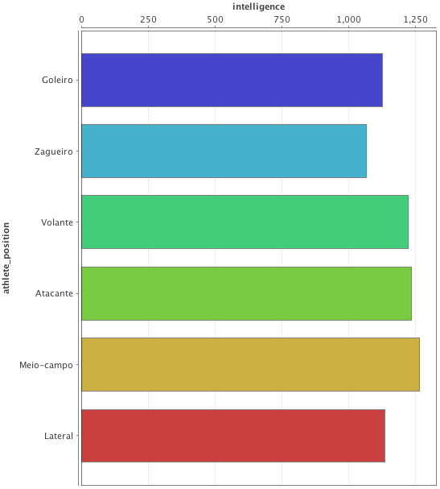
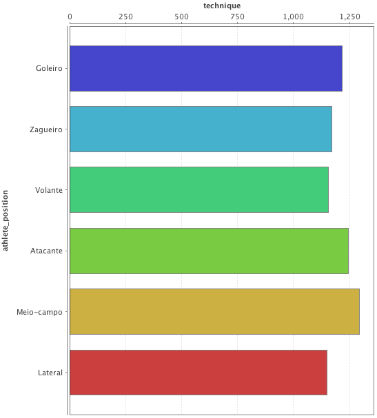
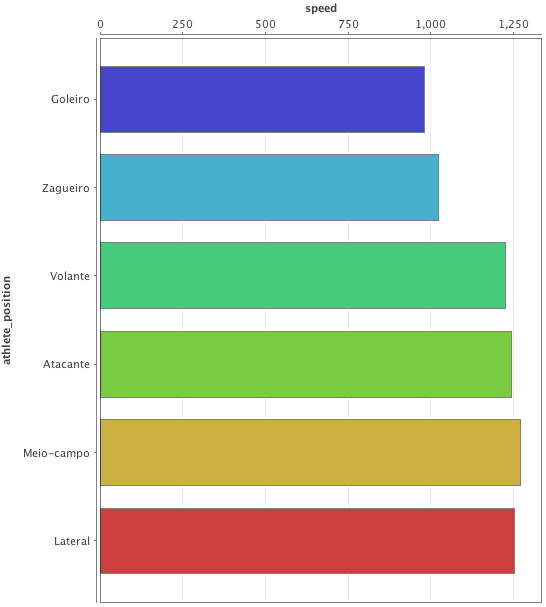
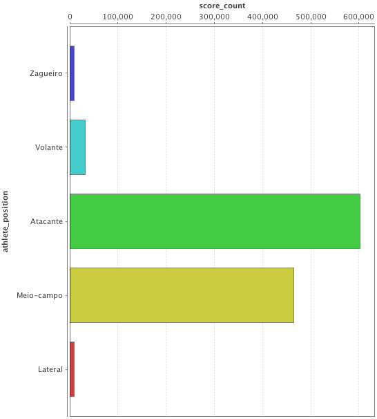
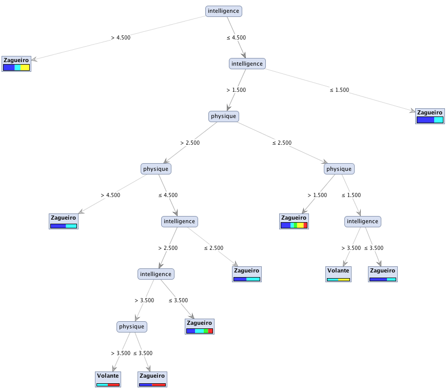
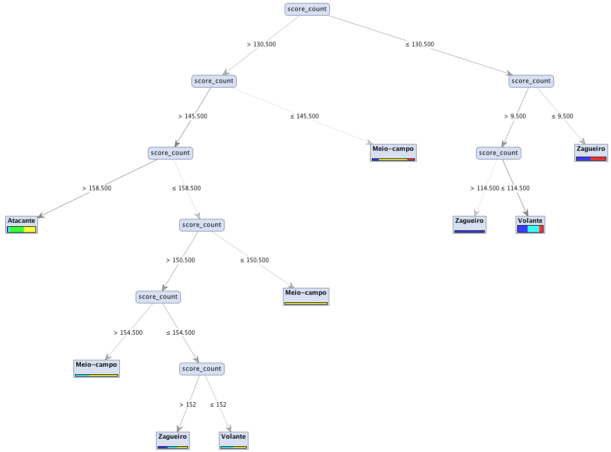

# Sumário

## 1 COMPONENTES
Igor Belo

## 2 INTRODUÇÃO E MOTIVAÇAO
O **VarzeaPro** é um sistema que auxilia o gerenciamento de times de futebol da várzea.

O **VarzeaPro** nasceu da ideia de atender às necessidades de administradores dos clubes. Atividades como gerenciamento de atletas, marcação de jogos, geração de estatísticas e controle de presença em partidas não são triviais sem uma ferramenta que centralize todas essas atividades.

## 3 MINI-MUNDO
VarzeaPro é um sistema voltado para administradores de equipes de várzea. O usuário realiza um cadastro fornecendo informações básicas ou realizando através do Facebook. Um usuário pode criar times. Um time possui logo, nome, cidade, data de fundação e presidente. O administrador pode adicionar outros administradores para gerenciarem os times. O administrador adiciona atletas ao seu time, sendo que cada atleta possui nome, e-mail, telefone e posição. Um atleta pode estar em mais de um time e com informações diferentes. Por exemplo, um atleta pode ser conhecido por um apelido em um time e por outro em outro time. O administrador pode cadastrar partidas do seu time, tanto passadas quanto futuras, sendo que uma partida possui uma arena (local), o time mandante, o visitante, data e hora. Além disso a partida pode ter estatísticas relacionadas a ela (gol, gol contra, cartão amarelo, cartão vermelho). Uma estatística de partida está relacionada a um time e a um atleta. Quando a partida futura é criada, os atletas da equipe recebem uma notificação para confirmarem a presença ou ausência na partida. Caso opte por se ausentar, o atleta pode justificar sua ausência.

## 4 RASCUNHOS BÁSICOS DA INTERFACE (MOCKUPS)
[Link dos mockups](./mockups.bmpr)

## 5 MODELO CONCEITUAL
### 5.1 NOTACAO ENTIDADE RELACIONAMENTO

### 5.2 DECISÕES DE PROJETO
Estatísticas da Partida: A decisão de colocar as estatísticas é para garantir uma certa escalabilidade. Futuramente caso sejam necessárias novas estatísticas novas colunas não precisam ser criadas. Além disso, garante que as estatísticas possam se relacionar com dados/tabelas, por exemplo: qual o tempo de jogo em que ocorreu um evento? A princípio essa informação não é armazenada mas facilmente adicionada sem muitos efeitos colaterais e "workarounds".

## 6 MODELO LÓGICO

## 7 MODELO FÍSICO

``` sql
BEGIN;
--
-- Create model Arena
--
CREATE TABLE "core_arena" ("id" serial NOT NULL PRIMARY KEY, "created" timestamp with time zone NOT NULL, "deleted" timestamp with time zone NULL, "name" varchar(50) NOT NULL, "latitude" double precision NULL, "longitude" double precision NULL);
--
-- Create model Athlete
--
CREATE TABLE "core_athlete" ("id" serial NOT NULL PRIMARY KEY, "created" timestamp with time zone NOT NULL, "deleted" timestamp with time zone NULL);
--
-- Create model City
--
CREATE TABLE "core_city" ("id" serial NOT NULL PRIMARY KEY, "created" timestamp with time zone NOT NULL, "deleted" timestamp with time zone NULL, "name" varchar(45) NOT NULL);
--
-- Create model Match
--
CREATE TABLE "core_match" ("id" serial NOT NULL PRIMARY KEY, "created" timestamp with time zone NOT NULL, "deleted" timestamp with time zone NULL, "when" timestamp with time zone NOT NULL, "arena_id" integer NOT NULL);
--
-- Create model MatchStat
--
CREATE TABLE "core_matchstat" ("id" serial NOT NULL PRIMARY KEY, "created" timestamp with time zone NOT NULL, "deleted" timestamp with time zone NULL, "athlete_id" integer NULL, "match_id" integer NOT NULL);
--
-- Create model Participation
--
CREATE TABLE "core_participation" ("id" serial NOT NULL PRIMARY KEY, "created" timestamp with time zone NOT NULL, "deleted" timestamp with time zone NULL, "going" boolean NOT NULL, "reason_not_going" varchar(140) NOT NULL, "athlete_id" integer NOT NULL, "match_id" integer NOT NULL);
--
-- Create model PasswordReset
--
CREATE TABLE "core_passwordreset" ("id" serial NOT NULL PRIMARY KEY, "created" timestamp with time zone NOT NULL, "deleted" timestamp with time zone NULL, "token" varchar(128) NOT NULL UNIQUE, "is_active" boolean NOT NULL, "user_id" integer NOT NULL);
--
-- Create model Position
--
CREATE TABLE "core_position" ("id" serial NOT NULL PRIMARY KEY, "created" timestamp with time zone NOT NULL, "deleted" timestamp with time zone NULL, "name" varchar(45) NOT NULL);
--
-- Create model Profile
--
CREATE TABLE "core_profile" ("id" serial NOT NULL PRIMARY KEY, "created" timestamp with time zone NOT NULL, "deleted" timestamp with time zone NULL, "photo" varchar(100) NULL, "birthday" date NULL, "phone" varchar(11) NULL);
--
-- Create model State
--
CREATE TABLE "core_state" ("id" serial NOT NULL PRIMARY KEY, "created" timestamp with time zone NOT NULL, "deleted" timestamp with time zone NULL, "name" varchar(45) NOT NULL);
--
-- Create model StatType
--
CREATE TABLE "core_stattype" ("id" serial NOT NULL PRIMARY KEY, "created" timestamp with time zone NOT NULL, "deleted" timestamp with time zone NULL, "name" varchar(50) NOT NULL);
--
-- Create model Team
--
CREATE TABLE "core_team" ("id" serial NOT NULL PRIMARY KEY, "created" timestamp with time zone NOT NULL, "deleted" timestamp with time zone NULL, "logo" varchar(100) NULL, "name" varchar(50) NOT NULL, "foundation" date NULL, "president" varchar(50) NULL, "city_id" integer NOT NULL);
--
-- Create model TeamAdmin
--
CREATE TABLE "core_teamadmin" ("id" serial NOT NULL PRIMARY KEY, "created" timestamp with time zone NOT NULL, "deleted" timestamp with time zone NULL, "profile_id" integer NOT NULL, "team_id" integer NOT NULL);
--
-- Add field teams to profile
--
--
-- Add field user to profile
--
ALTER TABLE "core_profile" ADD COLUMN "user_id" integer NOT NULL UNIQUE;
ALTER TABLE "core_profile" ALTER COLUMN "user_id" DROP DEFAULT;
--
-- Add field team to matchstat
--
ALTER TABLE "core_matchstat" ADD COLUMN "team_id" integer NULL;
ALTER TABLE "core_matchstat" ALTER COLUMN "team_id" DROP DEFAULT;
--
-- Add field type to matchstat
--
ALTER TABLE "core_matchstat" ADD COLUMN "type_id" integer NOT NULL;
ALTER TABLE "core_matchstat" ALTER COLUMN "type_id" DROP DEFAULT;
--
-- Add field home_team to match
--
ALTER TABLE "core_match" ADD COLUMN "home_team_id" integer NOT NULL;
ALTER TABLE "core_match" ALTER COLUMN "home_team_id" DROP DEFAULT;
--
-- Add field visitor_team to match
--
ALTER TABLE "core_match" ADD COLUMN "visitor_team_id" integer NOT NULL;
ALTER TABLE "core_match" ALTER COLUMN "visitor_team_id" DROP DEFAULT;
--
-- Add field state to city
--
ALTER TABLE "core_city" ADD COLUMN "state_id" integer NOT NULL;
ALTER TABLE "core_city" ALTER COLUMN "state_id" DROP DEFAULT;
--
-- Add field position to athlete
--
ALTER TABLE "core_athlete" ADD COLUMN "position_id" integer NOT NULL;
ALTER TABLE "core_athlete" ALTER COLUMN "position_id" DROP DEFAULT;
--
-- Add field profile to athlete
--
ALTER TABLE "core_athlete" ADD COLUMN "profile_id" integer NOT NULL;
ALTER TABLE "core_athlete" ALTER COLUMN "profile_id" DROP DEFAULT;
--
-- Add field team to athlete
--
ALTER TABLE "core_athlete" ADD COLUMN "team_id" integer NOT NULL;
ALTER TABLE "core_athlete" ALTER COLUMN "team_id" DROP DEFAULT;
ALTER TABLE "core_match" ADD CONSTRAINT "core_match_arena_id_ef50445f_fk_core_arena_id" FOREIGN KEY ("arena_id") REFERENCES "core_arena" ("id") DEFERRABLE INITIALLY DEFERRED;
CREATE INDEX "core_match_b297cc0f" ON "core_match" ("arena_id");
ALTER TABLE "core_matchstat" ADD CONSTRAINT "core_matchstat_athlete_id_9ffcd6fd_fk_core_athlete_id" FOREIGN KEY ("athlete_id") REFERENCES "core_athlete" ("id") DEFERRABLE INITIALLY DEFERRED;
ALTER TABLE "core_matchstat" ADD CONSTRAINT "core_matchstat_match_id_f729a9fd_fk_core_match_id" FOREIGN KEY ("match_id") REFERENCES "core_match" ("id") DEFERRABLE INITIALLY DEFERRED;
CREATE INDEX "core_matchstat_975a0aa5" ON "core_matchstat" ("athlete_id");
CREATE INDEX "core_matchstat_ff9c4e4a" ON "core_matchstat" ("match_id");
ALTER TABLE "core_participation" ADD CONSTRAINT "core_participation_athlete_id_6b115b03_fk_core_athlete_id" FOREIGN KEY ("athlete_id") REFERENCES "core_athlete" ("id") DEFERRABLE INITIALLY DEFERRED;
ALTER TABLE "core_participation" ADD CONSTRAINT "core_participation_match_id_bf1656f4_fk_core_match_id" FOREIGN KEY ("match_id") REFERENCES "core_match" ("id") DEFERRABLE INITIALLY DEFERRED;
CREATE INDEX "core_participation_975a0aa5" ON "core_participation" ("athlete_id");
CREATE INDEX "core_participation_ff9c4e4a" ON "core_participation" ("match_id");
ALTER TABLE "core_passwordreset" ADD CONSTRAINT "core_passwordreset_user_id_b11f45c1_fk_auth_user_id" FOREIGN KEY ("user_id") REFERENCES "auth_user" ("id") DEFERRABLE INITIALLY DEFERRED;
CREATE INDEX "core_passwordreset_e8701ad4" ON "core_passwordreset" ("user_id");
CREATE INDEX "core_passwordreset_token_35efe3a3_like" ON "core_passwordreset" ("token" varchar_pattern_ops);
ALTER TABLE "core_team" ADD CONSTRAINT "core_team_city_id_990296ad_fk_core_city_id" FOREIGN KEY ("city_id") REFERENCES "core_city" ("id") DEFERRABLE INITIALLY DEFERRED;
CREATE INDEX "core_team_c7141997" ON "core_team" ("city_id");
ALTER TABLE "core_teamadmin" ADD CONSTRAINT "core_teamadmin_profile_id_91798614_fk_core_profile_id" FOREIGN KEY ("profile_id") REFERENCES "core_profile" ("id") DEFERRABLE INITIALLY DEFERRED;
ALTER TABLE "core_teamadmin" ADD CONSTRAINT "core_teamadmin_team_id_a56e592a_fk_core_team_id" FOREIGN KEY ("team_id") REFERENCES "core_team" ("id") DEFERRABLE INITIALLY DEFERRED;
CREATE INDEX "core_teamadmin_83a0eb3f" ON "core_teamadmin" ("profile_id");
CREATE INDEX "core_teamadmin_f6a7ca40" ON "core_teamadmin" ("team_id");
ALTER TABLE "core_profile" ADD CONSTRAINT "core_profile_user_id_bf8ada58_fk_auth_user_id" FOREIGN KEY ("user_id") REFERENCES "auth_user" ("id") DEFERRABLE INITIALLY DEFERRED;
CREATE INDEX "core_matchstat_f6a7ca40" ON "core_matchstat" ("team_id");
ALTER TABLE "core_matchstat" ADD CONSTRAINT "core_matchstat_team_id_36e31a24_fk_core_team_id" FOREIGN KEY ("team_id") REFERENCES "core_team" ("id") DEFERRABLE INITIALLY DEFERRED;
CREATE INDEX "core_matchstat_94757cae" ON "core_matchstat" ("type_id");
ALTER TABLE "core_matchstat" ADD CONSTRAINT "core_matchstat_type_id_211f3fe7_fk_core_stattype_id" FOREIGN KEY ("type_id") REFERENCES "core_stattype" ("id") DEFERRABLE INITIALLY DEFERRED;
CREATE INDEX "core_match_e5623f1e" ON "core_match" ("home_team_id");
ALTER TABLE "core_match" ADD CONSTRAINT "core_match_home_team_id_1dc27130_fk_core_team_id" FOREIGN KEY ("home_team_id") REFERENCES "core_team" ("id") DEFERRABLE INITIALLY DEFERRED;
CREATE INDEX "core_match_0fc7cc15" ON "core_match" ("visitor_team_id");
ALTER TABLE "core_match" ADD CONSTRAINT "core_match_visitor_team_id_cea5543d_fk_core_team_id" FOREIGN KEY ("visitor_team_id") REFERENCES "core_team" ("id") DEFERRABLE INITIALLY DEFERRED;
CREATE INDEX "core_city_d5582625" ON "core_city" ("state_id");
ALTER TABLE "core_city" ADD CONSTRAINT "core_city_state_id_9aa9e056_fk_core_state_id" FOREIGN KEY ("state_id") REFERENCES "core_state" ("id") DEFERRABLE INITIALLY DEFERRED;
CREATE INDEX "core_athlete_bce5bd07" ON "core_athlete" ("position_id");
ALTER TABLE "core_athlete" ADD CONSTRAINT "core_athlete_position_id_5a9689d3_fk_core_position_id" FOREIGN KEY ("position_id") REFERENCES "core_position" ("id") DEFERRABLE INITIALLY DEFERRED;
CREATE INDEX "core_athlete_83a0eb3f" ON "core_athlete" ("profile_id");
ALTER TABLE "core_athlete" ADD CONSTRAINT "core_athlete_profile_id_4f14c388_fk_core_profile_id" FOREIGN KEY ("profile_id") REFERENCES "core_profile" ("id") DEFERRABLE INITIALLY DEFERRED;
CREATE INDEX "core_athlete_f6a7ca40" ON "core_athlete" ("team_id");
ALTER TABLE "core_athlete" ADD CONSTRAINT "core_athlete_team_id_9ff35180_fk_core_team_id" FOREIGN KEY ("team_id") REFERENCES "core_team" ("id") DEFERRABLE INITIALLY DEFERRED;
COMMIT;
```

## 8 INSERT APLICADO NAS TABELAS DO BANCO DE DADOS
### 8.1 DETALHAMENTO DAS INFORMAÇÕES
a) Os dados são gerados randomicamente utilizando a biblioteca faker do python.

b) ...

c) https://www.djangoproject.com/

https://www.postgresql.org/docs/

### 8.2 INCLUSÃO DO SCRIPT PARA CRIAÇÃO DE TABELA E INSERÇÃO DOS DADOS
Após clonar o projeto, crie um arquivo `settings_secret.py` no diretório [varzeapro](https://github.com/igorbelo/varzeapro/tree/master/varzeapro) e insira os dados de conexão do banco e uma `SECRET_KEY` da seguinte forma:
```
SECRET_KEY = '[string aleatória]'

DATABASES = {
    'default': {
        'ENGINE': 'django.db.backends.postgresql_psycopg2',
        'NAME': '[NOME_DO_BANCO]', # tem que estar criado
        'USER': '[USUARIO]',
        'PASSWORD': '[SENHA]',
        'HOST': 'localhost',
        'PORT': '5432',
    }
}
```

Instale as dependências do projeto com o comando:
```
pip install -r requirements.txt
```
Por fim, execute o comando que irá criar as tabelas
```
python manage.py migrate
```

Para popular o banco, execute o comando:
```
python manage.py populate_db
```

## 9 TABELAS E PRINCIPAIS CONSULTAS
### 9.1	GERACAO DE DADOS (MÍNIMO DE 1,5 MILHÃO DE REGISTROS PARA PRINCIPAL RELAÇAO)
```
python manage.py populate_db
```

### 9.2	SELECT DAS TABELAS COM PRIMEIROS 10 REGISTROS INSERIDOS
``` sql
SELECT * FROM auth_user LIMIT 10; --retorna os 10 primeiros usuários
SELECT * FROM core_profile LIMIT 10; --retorna os 10 primeiros perfis
SELECT * FROM core_athlete LIMIT 10; --retorna os 10 primeiros atletas
SELECT * FROM core_team LIMIT 10; --retorna os 10 primeiros times
SELECT * FROM core_arena LIMIT 10; --retorna as 10 primeiras arenas (locais de jogo)
SELECT * FROM core_match LIMIT 10; --retorna as 10 primeiras partidas
SELECT * FROM core_matchstat LIMIT 10; --retorna as 10 primeiras estatísticas das partidas
SELECT * FROM core_participation LIMIT 10; --retorna as 10 primeiras participações em jogos
SELECT * FROM core_state LIMIT 10; --retorna os 10 primeiros estados
SELECT * FROM core_city LIMIT 10; --retorna as 10 primeiras cidades
```

### 9.3	SELECT DAS VISÕES COM PRIMEIROS 10 REGISTROS DA VIEW
``` sql
-- atletas com mais gols marcados
CREATE OR REPLACE VIEW vw_athlete_score AS
SELECT (auth_user.first_name || ' ' || auth_user.last_name) AS athlete_name, core_team.name AS team_name, COUNT(core_matchstat.athlete_id) AS score_total FROM core_athlete
INNER JOIN core_profile ON (core_athlete.profile_id = core_profile.id)
INNER JOIN auth_user ON (core_profile.user_id = auth_user.id)
INNER JOIN core_team ON (core_athlete.team_id = core_team.id)
INNER JOIN core_matchstat ON (core_athlete.id = core_matchstat.athlete_id)
INNER JOIN core_stattype ON (core_matchstat.type_id = core_stattype.id)
WHERE core_stattype.name = 'goal'
GROUP BY auth_user.first_name,
auth_user.last_name,
core_team.name,
core_matchstat.athlete_id
ORDER BY score_total DESC;

-- times com mais gols marcados
CREATE OR REPLACE VIEW vw_team_score AS
SELECT core_team.name AS team_name, COUNT(core_matchstat.team_id) AS score_total FROM core_team
INNER JOIN core_matchstat ON (core_team.id = core_matchstat.team_id)
INNER JOIN core_stattype ON (core_matchstat.type_id = core_stattype.id)
WHERE core_stattype.name = 'goal'
GROUP BY core_team.name
ORDER BY score_total DESC;

-- atributos do atleta com a posição e quantidade de gols marcados
CREATE OR REPLACE VIEW vw_athlete_score_with_attributes_and_position AS
SELECT
    (SELECT core_athleteattribute.value FROM core_athleteattribute INNER JOIN core_attribute ON (core_athleteattribute.attribute_id = core_attribute.id) WHERE core_attribute.name = 'speed' AND core_athleteattribute.athlete_id = core_athlete.id
    ) AS speed,
    (SELECT core_athleteattribute.value FROM core_athleteattribute INNER JOIN core_attribute ON (core_athleteattribute.attribute_id = core_attribute.id) WHERE core_attribute.name = 'technique' AND core_athleteattribute.athlete_id = core_athlete.id
    ) AS technique,
    (SELECT core_athleteattribute.value FROM core_athleteattribute INNER JOIN core_attribute ON (core_athleteattribute.attribute_id = core_attribute.id) WHERE core_attribute.name = 'intelligence' AND core_athleteattribute.athlete_id = core_athlete.id
    ) AS intelligence,
    (SELECT core_athleteattribute.value FROM core_athleteattribute INNER JOIN core_attribute ON (core_athleteattribute.attribute_id = core_attribute.id) WHERE core_attribute.name = 'physique' AND core_athleteattribute.athlete_id = core_athlete.id
    ) AS physique,
    core_position.name AS athlete_position,
    count(core_matchstat.athlete_id) AS score_count,
    core_athlete.id AS athlete_id
FROM core_athlete
INNER JOIN core_position ON (core_athlete.position_id = core_position.id)
INNER JOIN core_matchstat ON (core_athlete.id = core_matchstat.athlete_id)
WHERE core_matchstat.type_id = 1
GROUP BY core_athlete.id, speed, technique, intelligence, physique, athlete_position;
```

### 9.4	LISTA DE CODIGOS DAS FUNÇÕES, ASSERÇOES E TRIGGERS

### 9.5	APLICAÇAO DE ÍNDICES E TESTES DE PERFORMANCE

### 9.6	ANÁLISE DOS DADOS COM RAPIDMINER
#### Posição X Físico


#### Posição X Inteligência


#### Posição X Técnica


#### Posição X Velocidade


#### Posição X Gols


#### Decisão de Posição por físico e inteligência


#### Decisão de Posição por quantidade de gols marcados


## 10 ATUALIZAÇÃO DA DOCUMENTAÇÃO/SLIDES E ENTREGA FINAL

## 11 DIFICULDADES ENCONTRADAS PELO GRUPO
A maior dificuldade foi na análise dos dados. Como a natureza dos dados é aleatória, foi difícil identificar padrões nas análises.
