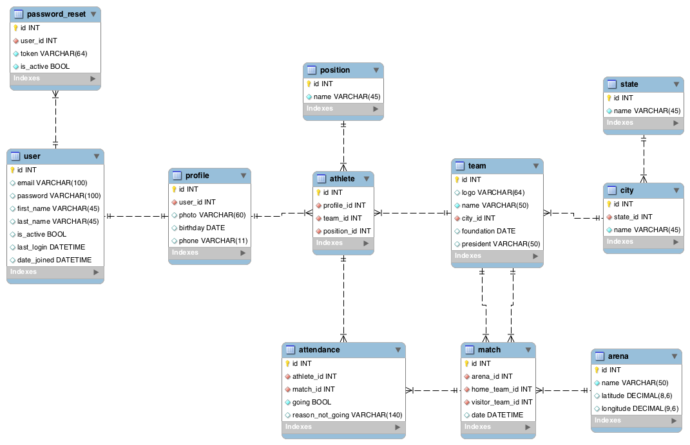

# Sumário

## 1 COMPONENTES
Igor Belo

## 2 INTRODUÇÃO E MOTIVAÇAO
O **VarzeaPro** é um sistema que auxilia o gerenciamento de times de futebol da várzea.

O **VarzeaPro** nasceu da ideia de atender às necessidades de administradores dos clubes. Atividades como gerenciamento de atletas, marcação de jogos, geração de estatísticas e controle de presença em partidas não são triviais sem uma ferramenta que centralize todas essas atividades.

## 3 MINI-MUNDO
VarzeaPro é um sistema voltado para administradores de equipes de várzea. O usuário realiza um cadastro fornecendo informações básicas ou realizando através do Facebook. Um usuário pode criar times. Um time possui logo, nome, cidade, data de fundação e presidente. O administrador pode adicionar outros administradores para gerenciarem os times. O administrador adiciona atletas ao seu time, sendo que cada atleta possui nome, e-mail, telefone e posição. Um atleta pode estar em mais de um time e com informações diferentes. Por exemplo, um atleta pode ser conhecido por um apelido em um time e por outro em outro time. O administrador pode cadastrar partidas do seu time, tanto passadas quanto futuras, sendo que uma partida possui uma arena (local), o time mandante, o visitante, data e hora. Além disso a partida pode ter estatísticas relacionadas a ela (gol, gol contra, cartão amarelo, cartão vermelho). Uma estatística de partida está relacionada a um time e a um atleta. Quando a partida futura é criada, os atletas da equipe recebem uma notificação para confirmarem a presença ou ausência na partida. Caso opte por se ausentar, o atleta pode justificar sua ausência.

## 4 RASCUNHOS BÁSICOS DA INTERFACE (MOCKUPS)
[Link dos mockups](./mockups.bmpr)

## 5 MODELO CONCEITUAL
### 5.1 NOTACAO ENTIDADE RELACIONAMENTO

### 5.2 DECISÕES DE PROJETO
    Estatísticas da Partida: A decisão de colocar as estatísticas é para garantir uma certa escalabilidade. Futuramente caso sejam necessárias novas estatísticas novas colunas não precisam ser criadas. Além disso, garante que as estatísticas possam se relacionar com dados/tabelas, por exemplo: qual o tempo de jogo em que ocorreu um evento? A princípio essa informação não é armazenada mas facilmente adicionada sem muitos efeitos colaterais e "workarounds".

## 6 MODELO LÓGICO

## 7 MODELO FÍSICO

## 8 INSERT APLICADO NAS TABELAS DO BANCO DE DADOS
### 8.1 DETALHAMENTO DAS INFORMAÇÕES
Após clonar o projeto, crie um arquivo `settings_secret.py` no diretório [varzeapro](https://github.com/igorbelo/varzeapro/tree/master/varzeapro) e insira os dados de conexão do banco e uma `SECRET_KEY` da seguinte forma:
```
SECRET_KEY = '[string aleatória]'

DATABASES = {
    'default': {
        'ENGINE': 'django.db.backends.postgresql_psycopg2',
        'NAME': '[NOME_DO_BANCO]', # tem que estar criado
        'USER': '[USUARIO]',
        'PASSWORD': '[SENHA]',
        'HOST': 'localhost',
        'PORT': '5432',
    }
}
```

Instale as dependências do projeto com o comando:
```
pip install -r requirements.txt
```
Por fim, execute o comando que irá criar as tabelas
```
python manage.py migrate
```

### 8.2 INCLUSÃO DO SCRIPT PARA CRIAÇÃO DE TABELA E INSERÇÃO DOS DADOS
Para popular o banco, execute o comando:
```
python manage.py populate_db
```

## 9 TABELAS E PRINCIPAIS CONSULTAS
### 9.1	GERACAO DE DADOS (MÍNIMO DE 1,5 MILHÃO DE REGISTROS PARA PRINCIPAL RELAÇAO)
```
python manage.py populate_db
```

### 9.2	SELECT DAS TABELAS COM PRIMEIROS 10 REGISTROS INSERIDOS
``` sql
SELECT * FROM auth_user LIMIT 10; --retorna os 10 primeiros usuários
SELECT * FROM core_profile LIMIT 10; --retorna os 10 primeiros perfis
SELECT * FROM core_athlete LIMIT 10; --retorna os 10 primeiros atletas
SELECT * FROM core_team LIMIT 10; --retorna os 10 primeiros times
SELECT * FROM core_arena LIMIT 10; --retorna as 10 primeiras arenas (locais de jogo)
SELECT * FROM core_match LIMIT 10; --retorna as 10 primeiras partidas
SELECT * FROM core_matchstat LIMIT 10; --retorna as 10 primeiras estatísticas das partidas
SELECT * FROM core_participation LIMIT 10; --retorna as 10 primeiras participações em jogos
SELECT * FROM core_state LIMIT 10; --retorna os 10 primeiros estados
SELECT * FROM core_city LIMIT 10; --retorna as 10 primeiras cidades
```

### 9.3	SELECT DAS VISÕES COM PRIMEIROS 10 REGISTROS DA VIEW
``` sql
-- atletas com mais gols marcados
CREATE OR REPLACE VIEW vw_athlete_score AS
SELECT (auth_user.first_name || ' ' || auth_user.last_name) AS athlete_name, core_team.name AS team_name, COUNT(core_matchstat.athlete_id) AS score_total FROM core_athlete
INNER JOIN core_profile ON (core_athlete.profile_id = core_profile.id)
INNER JOIN auth_user ON (core_profile.user_id = auth_user.id)
INNER JOIN core_team ON (core_athlete.team_id = core_team.id)
INNER JOIN core_matchstat ON (core_athlete.id = core_matchstat.athlete_id)
INNER JOIN core_stattype ON (core_matchstat.type_id = core_stattype.id)
WHERE core_stattype.name = 'goal'
GROUP BY auth_user.first_name,
auth_user.last_name,
core_team.name,
core_matchstat.athlete_id
ORDER BY score_total DESC;

-- times com mais gols marcados
CREATE OR REPLACE VIEW vw_team_score AS
SELECT core_team.name AS team_name, COUNT(core_matchstat.team_id) AS score_total FROM core_team
INNER JOIN core_matchstat ON (core_team.id = core_matchstat.team_id)
INNER JOIN core_stattype ON (core_matchstat.type_id = core_stattype.id)
WHERE core_stattype.name = 'goal'
GROUP BY core_team.name
ORDER BY score_total DESC;
```

### 9.4	LISTA DE CODIGOS DAS FUNÇÕES, ASSERÇOES E TRIGGERS

### 9.5	APLICAÇAO DE ÍNDICES E TESTES DE PERFORMANCE
    a) Lista de índices, tipos de índices com explicação de porque foram implementados
    b) Performance esperada VS Resultados obtidos
    c) Tabela de resultados comparando velocidades antes e depois da aplicação dos índices.

    Data de Entrega: 16/11/2016

### 9.6	ANÁLISE DOS DADOS COM ORANGE


## 10 ATUALIZAÇÃO DA DOCUMENTAÇÃO/SLIDES E ENTREGA FINAL

    Data de Entrega: 23/11/2016

## 11 DIFICULDADES ENCONTRADAS PELO GRUPO
